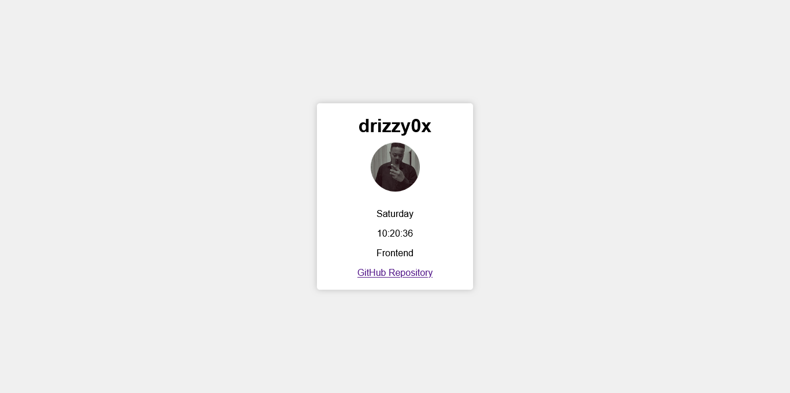

# HNG Profile

This is a simple web page showcasing personal information and real-time data attributes, created as part of the HNG Frontend Track Stage One Task.

## Overview

This web page displays personal information along with real-time data attributes. It includes the following elements:

- **Slack Name:** drizzy0x
- **Slack Display Picture:** 
- **Current Day of the Week:** (Updates automatically based on Nigeria's timezone)
- **Current Time in Nigeria's Timezone:** (Updates automatically every second)
- **Track:** Frontend
- **GitHub Repository:** [GitHub Repository](https://github.com/drizzy009/hngix-stage-one)

## Features

- Real-time display of the current day of the week and time in Nigeria's timezone.
- A link to the author's GitHub repository.
- Responsive design for various screen sizes.

## Screenshot



## Technologies Used

- HTML
- CSS
- JavaScript
- Timezone information from `Intl.DateTimeFormat`

## How to Use

1. Clone this repository to your local machine:

   ```bash
   git clone https://github.com/drizzy009/hngix-stage-one.git
